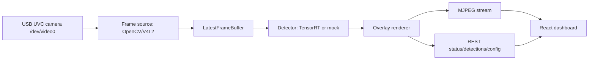

# Architecture

## Runtime Flow

The backend uses a single-slot latest-frame buffer. Slow browsers or network clients do not create a frame backlog; the next generated frame overwrites the previous frame and the stream client waits for the newest version.

## Backend

`jetson_yolo_web.runtime.RuntimeService` owns the camera source, detector, frame buffer, status, and snapshot lifecycle. Camera and detector creation are lazy so config changes can close/rebuild only the affected object.

Frame sources:

- `OpenCVCamera` for USB UVC devices through V4L2.
- `VideoFileCamera` for sample-video integration testing.
- `SyntheticCamera` for local development without Jetson hardware.

Detector backends:

- `TensorRTYOLODetector` loads `.engine` files through JetPack TensorRT/PyCUDA and parses common YOLOv8 COCO output shapes.
- `MockDetector` provides deterministic detections for development, tests, and fallback when `detector_backend=auto` and no engine is present.

## Frontend

The dashboard is a single React/Vite app. It reads `/stream.mjpg` through an `img` element and polls `/api/status`, `/api/detections/latest`, and `/api/config`. Runtime controls submit partial updates through `PUT /api/config`.

The UI follows a control-console model: large video workspace, compact status bar, detection inspector, class distribution, and runtime settings drawer.

## Failure Modes

- Missing OpenCV or disconnected camera sets `health=error`, publishes a placeholder frame, and retries.
- Missing TensorRT engine in `auto` mode falls back to mock detection; explicit `detector_backend=tensorrt` reports an error.
- Invalid config updates return HTTP 400 and do not mutate runtime config.
- Snapshot requests always return an image/JSON pair; if no live frame exists, a placeholder image is saved.
